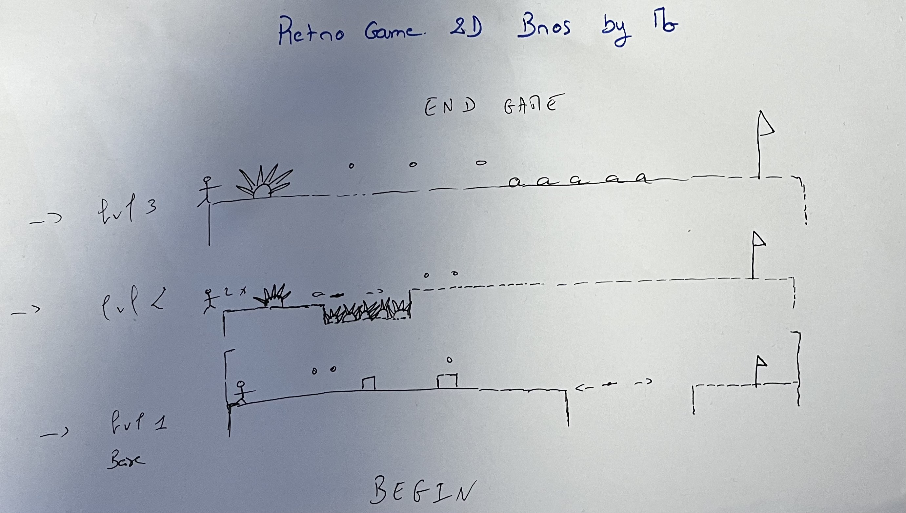

# 2D-Retro-Game-by-Mo

<b> <U> Student: Moustapha SY </U> </b>

<b>  <U> Description : </U> </b>

L'objectif de ce projet est de pouvoir faire en sorte de nous familiariser avec le langage KOTLIN, qui se rapproche du langage vu cette année JAVA. Les différents travaux pratiques nous ont permis de nous familiariser avec celui-ci et de comprendre l'aspect théorique accompagné de la pratique avec les != travaux.

Les différentes notions attendues du livrables sont les suivantes:
